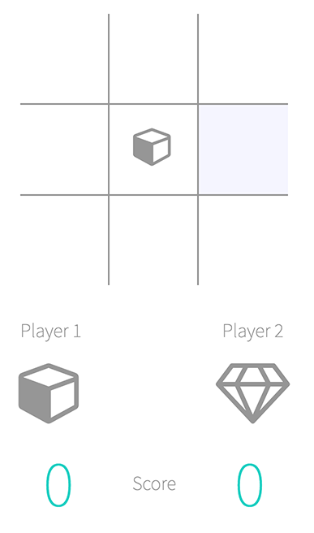

#TIC TAC TOE

brought to you by Daniele Peviani

live [demo](http://dansyd.github.io/tic-tac-toe "Demo")

This is my take on recreating the world famous game of Tic Tac Toe. As you probably already know, the goal is to line up three of your "tokens" horizontally, vertically or diagonally. There is an initialization panel at the beginning of the game, where the 2 players have the option to chose the icon they want to use in the game.

I've used HTML and CSS to layout and style the game, Javascript to run the program operations and jQuery for DOM manipulation.
